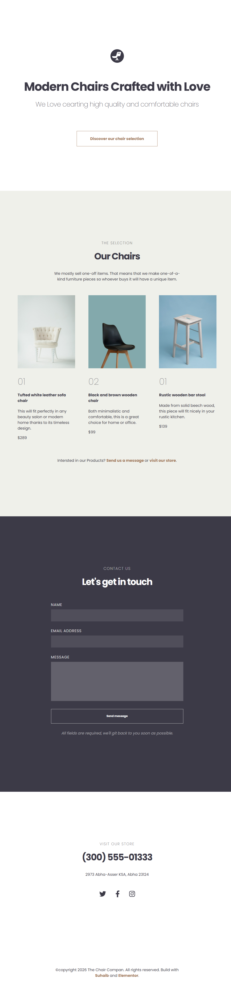

# Responsive Landing Page - Modern Chairs 🪑

A beautiful, responsive landing page for a premium furniture store, showcasing modern chairs crafted with high-quality materials. This project focuses on typography, clean layouts, and a seamless user experience across different devices.

---

## 📸 Project Showcase

  
  
<i>A preview of the landing page featuring the Hero, Gallery, and Contact sections.</i>

---

[🔗 View Live Demo](https://suhaibadill.github.io/responsive-landing-page/)

A beautiful, responsive landing page for a premium furniture store...

## 🛠 Features

- **Responsive Gallery:** A CSS Grid-based furniture showcase that adjusts to any screen size.
- **Modern Typography:** Using Google Fonts (Poppins) with carefully calculated `rem` units for perfect hierarchy.
- **Semantic HTML:** Structured with header, section, and footer tags for SEO and accessibility.
- **Dark Mode Section:** A dedicated contact section with a high-contrast dark theme.

---

## 🏗 Built With

- **HTML5:** Semantic structure.
- **CSS3:** Custom properties (Variables), Flexbox, and advanced selectors.
- **Google Fonts:** Poppins (Weights: 200, 400, 600, 700, 900).

---
